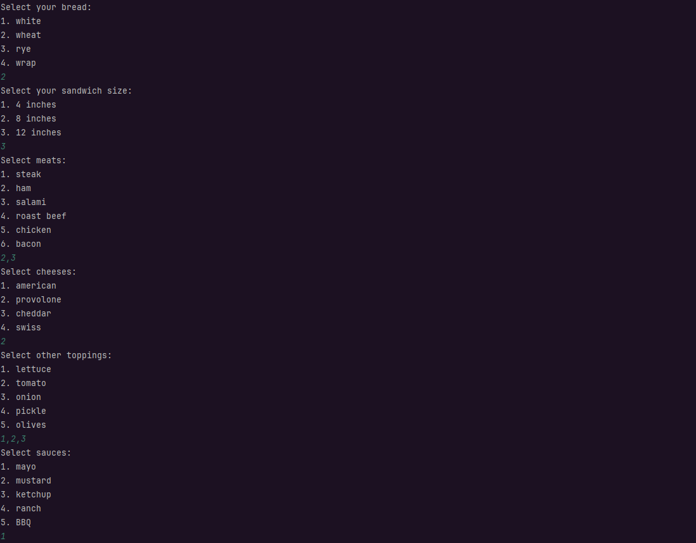
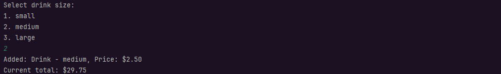

# Capstone Two - DELI-cious Deli

The scope of this application is to be a point of sales application for Deli-cious Deli.
The main functionality of this application is to allow customers to be able to order deli
full menu. Customers are able to either fully customize their sandwiches or order from a
signature sandwich, they are also able to add a drink or chips to their order.

## Application Home Screen

## Scheduling Order

Upon attempting to place a new order the user is prompted whether they want to schedule the order.
This is here to allow for user to submit orders to a specific date and time that they wish to have their
order logged to. If a time is not scheduled the order once checked out will be scheduled at the time of
checkout.

## Main Menu

Here is where customers will choose from the various options ordering options that they have available to them.

**
Add a Custom Sandwich
**

When a customer chooses to add a custom sandwich they will be prompted to choose following options:

1. **Bread**:
2. **Sandwich Size**
3. **Meats**
4. **Cheeses**
5. **Toppings**
6. **Sauces**

Within each menu themselves a customer can choose all the options that they want at once. The prices
will be applied as necessary for all toppings that cost additions that incur an additional charge.

Once a customer creates a sandwich it is immediately printed out with all their chosen options. They are
also taken back to the main menu with the price tracking dynamically.

**
Add a Signature Sandwich
**

Signature sandwiches are pre-made sandwiches from DELI-cious Deli. These sandwiches already have preset
customization options and set prices.

**
Add a Drink
**

There are 3 sizes of drinks that can be added each with their own prices:

1. Small
2. Medium
3. Large

**
Add Chips
**

There are 4 flavors of chips that can be added:

1. Regular
2. Barbecue
3. Sour Cream & Onion
4. Salt & Vinegar

**
Checkout
**

Once a customer decides that they are finished orders and choose to checkout, An order summary is displayed.
This summary display every item that is ordered along with the prices of each item. A total is then shown.
The receipt message is scheduled and printed at the time that the order initially began processing. It is 
written into the receipts directory.

Customers are returned to the main menu once the order is processed and the previous order is cleared.

**
Cancel Order
**

At any point in the process, a customer can decide to cancel their order and return to the home screen.

## Error Handling 

Each part of the application is made to deal with inputs that are not integrated into the menus.
This was accomplished by using a helper method that wrapped only the user input with the necessary exception
handling.

An example of this is demonstrated below in two different forms:

Each of these produce different results based on where you are in the ordering process.

## Interesting Piece of Code

**
Admin Mode
**

Admin is an interface that I created.

It is implemented by my UserInterface class.

The main function of the Admin Mode option is to allow for the printing of all receipts that have been
created. The mode is password protected and will kick a user back to the main menu if the wrong password
is input.

This is the code that Print All Receipts is using:

Which then displays the following:

